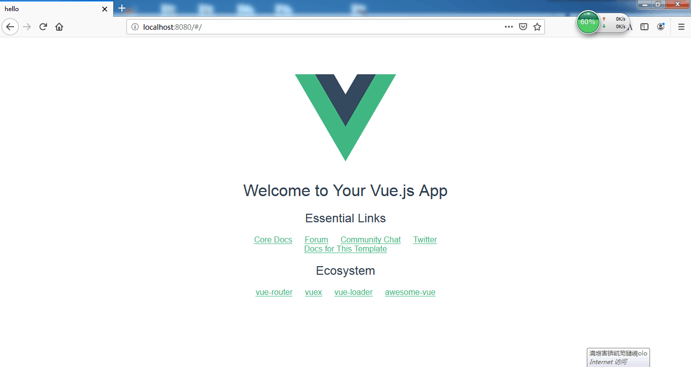

# Vue-works-1

第一次有关Vue的作业

1.创建vue cli项目, 跑通初始项目, 截图保存

2.修改初始项目, 制作计数器, 点击button, 计数器数字+1那种

3.创建项目, 展示vue的生命周期, 项目截图存入README.md, 源码保存(请去除node_modules文件夹)

*4.(选做, 高玩请务必试一试)创建项目, 制作绿荫首页, 首页展示markdown文档, 展示图片那种(请自由发挥)

5.所有保存的文件, 发到[仓库](https://github.com/njtechgreenstudio/vue-class-first.git)托管

## 初始项目运行结果

